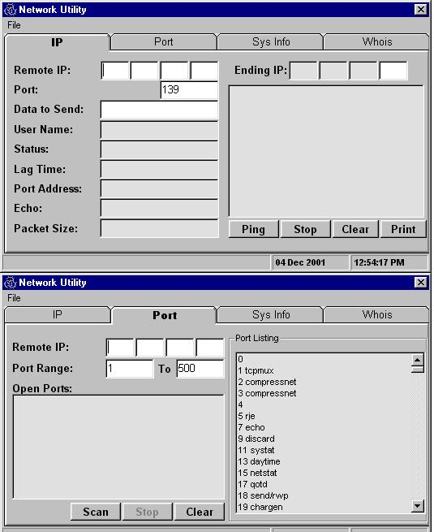



## Ping/Ip Scan/Port Scan/Who Is

### Description

I wanted to learn winsock control so created a compilation of various functions into one. Provides ping, ip scan with user name listing, port scan, list of ports, cpu info, and who is look up. I use only one winsock control for all of the functions instead of preloading with maxsockets. I prefer to use/close as I go to prevent bugs but there always other methods of doing this. I noted for easier understanding. Code is also broken down into functional units, each module is broken down for particular use so porting them to other apps should be an easy thing. Hope you enjoy!
 
### More Info
 

             |
---                |---
**Submitted On**   |2001-12-04 13:04:46
**By**             |[Alex Fredricks](https://github.com/Planet-Source-Code/PSCIndex/blob/master/ByAuthor/alex-fredricks.md)
**Level**          |Intermediate
**User Rating**    |3.7 (11 globes from 3 users)
**Compatibility**  |VB 5\.0, VB 6\.0
**Category**       |[Miscellaneous](https://github.com/Planet-Source-Code/PSCIndex/blob/master/ByCategory/miscellaneous__1-1.md)
**World**          |[Visual Basic](https://github.com/Planet-Source-Code/PSCIndex/blob/master/ByWorld/visual-basic.md)
**Archive File**   |[Ping\_Ip\_Sc394081242001\.zip](https://github.com/Planet-Source-Code/alex-fredricks-ping-ip-scan-port-scan-who-is__1-29472/archive/master.zip)

### API Declarations

System info api declarations

